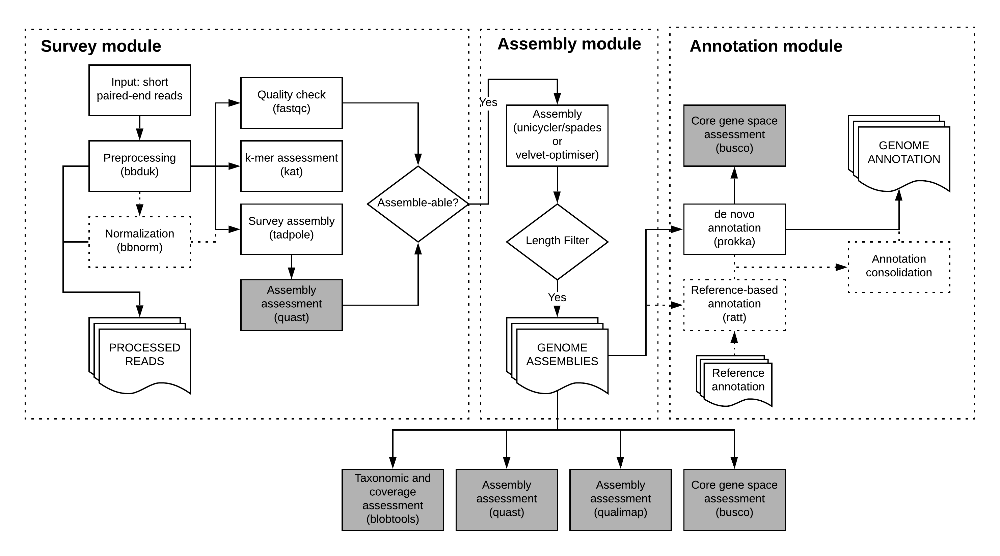

.. bgrrl documentation master file, created by
   sphinx-quickstart on Thu Apr  4 12:14:34 2019.
   You can adapt this file completely to your liking, but it should at least
   contain the root `toctree` directive.

The annotate module
======================

The annotate performs de novo, and optionally reference-based, genome annotation on a set of assemblies.

Sample sheet preparation
------------------------

If the user has previously run the ``assemble`` module without annotation, the resulting samplesheet ``samplesheet.asm_pass.tsv`` can be used directly 
to drive the annotate module.

Otherwise, the user should prepare a comma-separated samplesheet following the column order below.

1. Sample ID
2. Sample Name (can be the same as Sample ID; the intention is to allow a more understandable sample reference in the future)
3. Full path to assembly file

**TODO: CHECK**

Command line arguments
----------------------

The command ``bgrrl -h`` or ``bgrrl <stage> -h`` (or ``--help`` instead of ``-h``) will display a list of command line options.

**Remember each bgrr| run requires at the very least the following three command line parameters:**

* ``input_sheet``
* ``--config``
* ``--hpc_config``

annotate options:
^^^^^^^^^^^^^^^^^

* ``--custom-prokka-proteins CUSTOM_PROKKA_PROTEINS``

                        If you have a custom protein database that you would
                        like prokka to use (``prokka``'s ``--proteins`` option), then specify
                        the path to it here. [n/a]

* ``--ratt-reference RATT_REFERENCE``

                        Path to reference data for ratt annotation transfer

* ``--no-packaging``

      Disable automatic packaging. [False]

* ``--prokka-package-style {by_sample,all_in_one}``

                        Should the prokka annotation be packaged into one
                        directory per sample (by_sample) or into one single
                        directory (all_in_one)? [by_sample]

