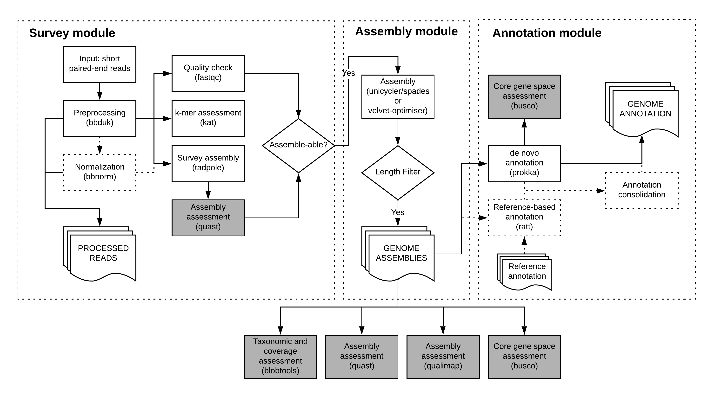

.. bgrrl documentation master file, created by
   sphinx-quickstart on Thu Apr  4 12:14:34 2019.
   You can adapt this file completely to your liking, but it should at least
   contain the root `toctree` directive.

General Run Parameters
======================

bgrr| consists of three main modules: ``survey``, ``assemble``, and ``annotate``. Each module, or stage, has individual command line options. This section describes common command line options.

**Each bgrr| run requires at the very least the following three command line parameters:**

* ``input_sheet``
* ``--config``
* ``--hpc_config``

Command line arguments
----------------------

The command ``bgrrl -h`` or ``bgrrl <stage> -h`` (or ``--help`` instead of ``-h``) will display a list of command line options.

The first block of command line options is stage-specific and will be discussed in the description of each stage. 

bgrr| options:
^^^^^^^^^^^^^^

* ``input_sheet``

  This is the path to a samplesheet, a comma-separated file, containing location and meta-information for each sample/library (REQUIRED!).

* ``-o OUTPUT_DIR, --output-dir OUTPUT_DIR``

  Output will be written to the specified directory [Analysis].

* ``--project-prefix PROJECT_PREFIX``

  Reports and data packages will be prefixed by this string []

* ``--config CONFIG``

  Path to configuration file. This file specifies software configurations, resource locations and general project metadata (REQUIRED!).

* ``--report-only``

  With this option, bgrr| Only (re-)runs reporting modules. No snakemake pipelines are called.

* ``-f, --force``

  Force overwriting existing output directory, causes pipeline to be restarted. (CURRENTLY DISABLED)

* ``--enterobase-groups ENTEROBASE_GROUPS``

  Comma-separated list of Enterobase microbial organisms. The set of assemblies is tested against
  organism-specific criteria and assemblies are packaged according to their species. [NEEDS REWORDING!]. 
  By default, the enterobase mode is disabled.

HPC Options:
^^^^^^^^^^^^

Controls for how jobs should behave across the HPC resources.

* ``--partition PARTITION``

  Will run all child jobs on this partition/queue, this setting overrides anything specified in the ``--hpc_config`` file.

* ``--scheduler SCHEDULER``

  The job scheduler to use. LSF, PBS and SLURM are currently supported. If running without a scheduler type NONE here. Assumes SLURM by default.

* ``--no_drmaa``

  Use this flag if DRMAA is not available.

* ``-N MAX_NODES, --max_nodes MAX_NODES``

  Maximum number of nodes to use concurrently

* ``-c MAX_CORES, --max_cores MAX_CORES``

  Maximum number of cores to use concurrently

* ``--hpc_config HPC_CONFIG``

  Configuration file for the HPC. Can be used to override what resources and partitions each job uses. (REQUIRED!)

* ``--unlock``
  
  If the snakemake pipeline is not running because it is reporting that the directory is locked, then you can
  unlock it using this option. Please make sure that there are no other snakemake jobs are running in this
  directory before using this option!

